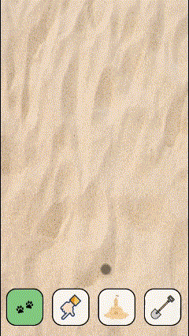
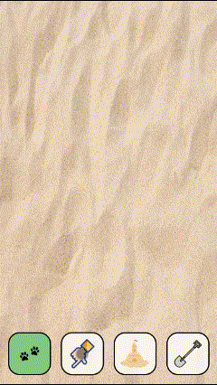
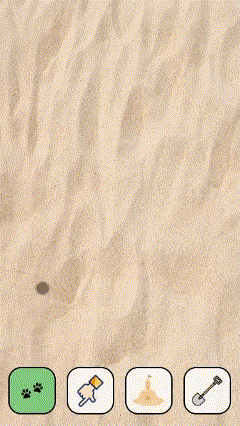

# Drawing Tool for Phones

## Best viewed on mobile

This tool replicates the experience of drawing in the sand. Users can select different modes to interact with the canvas, including:

- **Paw Prints**: Leave paw prints in the sand.
- **Draw in Sand**: Draw freehand in the sand.
- **Build Sand Castles**: Add sand castles to the canvas.
- **Shovel Sand**: Remove sand or erase your creations.
  **Hint:** _A surprise awaits you beneath the sand!_ 👀

Feel free to explore the different features and enjoy the sand-drawing experience!

[Documentation](https://bevyip.notion.site/Week-4-18e5b3e7f9e7809aa8a2e26c89125629?pvs=4)

